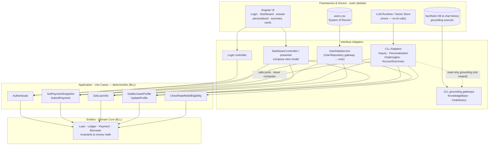

```mermaid
flowchart TB
  subgraph OUTER["Frameworks &amp; Drivers · outer (details)"]
    direction LR
    UIU["Angular UI<br/>Login · Dashboard · answer<br/>personalized · summary cards"]
    LLM["LLM Runtime / Vector Store<br/>(mock — no AI calls)"]
    CSV[("users.csv<br/>System of Record")]
    KB[("Synthetic KB &amp; chat history<br/>grounding sources")]
  end

  subgraph ADAPT["Interface Adapters"]
    direction LR
    CTRL["Dashboard controller / presenter<br/>compose view model"]
    LOGINC["Login controller"]
    CLLA["CLL Adapters<br/>Inquiry · Personalization<br/>ChatInsights · AccountSummary"]
    REPO["UserDataService<br/>(UserRepository gateway → core)"]
    GND["CLL grounding gateways<br/>KnowledgeBase · ChatHistory"]
  end

  subgraph APP["Application · Use Cases — deterministic (BLL)"]
    direction LR
    UCAUTH["Authenticate"]
    UCPAY["GetPaymentSnapshot<br/>SubmitPayment"]
    UCLOAN["GetLoanInfo"]
    UCPROF["GetBorrowerProfile<br/>UpdateProfile"]
    UCELIG["CheckRateReliefEligibility"]
  end

  subgraph DOM["Entities · Domain Core (BLL)"]
    ENT["Loan · Ledger · Payment · Borrower<br/>invariants &amp; money math"]
  end

  %% Frameworks depend on adapters
  UIU --> CTRL
  UIU --> LOGINC
  LLM --> CLLA
  CSV --> REPO
  KB --> GND

  %% Adapters depend on use-case ports (inward only)
  CTRL --> UCPAY
  CTRL --> UCLOAN
  CTRL --> UCPROF
  LOGINC --> UCAUTH
  CLLA -->|"calls ports · never computes"| UCPAY
  CLLA --> UCLOAN
  CLLA --> UCPROF
  CLLA --> UCELIG
  CLLA -.->|"read-only grounding (not inward)"| GND
  REPO --> UCAUTH
  REPO --> UCPAY
  REPO --> UCLOAN
  REPO --> UCPROF

  %% Use cases depend on entities
  UCAUTH --> ENT
  UCPAY --> ENT
  UCLOAN --> ENT
  UCPROF --> ENT
  UCELIG --> ENT
```