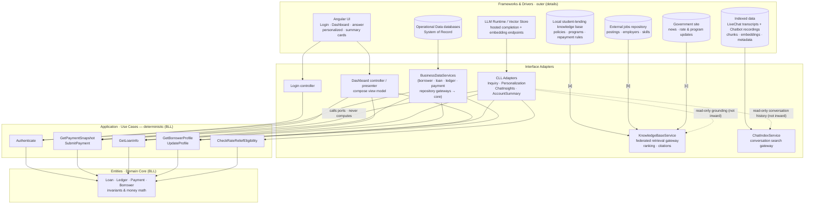

```mermaid
flowchart TB
  subgraph OUTER["Frameworks &amp; Drivers · outer (details)"]
    direction LR
    UIU["Angular UI<br/>Login · Dashboard · answer<br/>personalized · summary cards"]
    LLM["LLM Runtime / Vector Store<br/>hosted completion + embedding endpoints"]
    ODS[("Operational Data databases<br/>System of Record")]
    KBL[("Local student-lending knowledge base<br/>policies · programs · repayment rules")]
    JOBS[("External jobs repository<br/>postings · employers · skills")]
    GOV[("Government site<br/>news · rate &amp; program updates")]
    CIDX[("Indexed data<br/>LiveChat transcripts + Chatbot recordings<br/>chunks · embeddings · metadata")]
  end

  subgraph ADAPT["Interface Adapters"]
    direction LR
    CTRL["Dashboard controller / presenter<br/>compose view model"]
    LOGINC["Login controller"]
    CLLA["CLL Adapters<br/>Inquiry · Personalization<br/>ChatInsights · AccountSummary"]
    BDS["BusinessDataServices<br/>(borrower · loan · ledger · payment<br/>repository gateways → core)"]
    KBS["KnowledgeBaseService<br/>federated retrieval gateway<br/>ranking · citations"]
    CIS["ChatIndexService<br/>conversation search gateway"]
  end

  subgraph APP["Application · Use Cases — deterministic (BLL)"]
    direction LR
    UCAUTH["Authenticate"]
    UCPAY["GetPaymentSnapshot<br/>SubmitPayment"]
    UCLOAN["GetLoanInfo"]
    UCPROF["GetBorrowerProfile<br/>UpdateProfile"]
    UCELIG["CheckRateReliefEligibility"]
  end

  subgraph DOM["Entities · Domain Core (BLL)"]
    ENT["Loan · Ledger · Payment · Borrower<br/>invariants &amp; money math"]
  end

  %% Frameworks depend on adapters
  UIU --> CTRL
  UIU --> LOGINC
  LLM --> CLLA
  ODS --> BDS
  KBL -->|"[a]"| KBS
  JOBS -->|"[b]"| KBS
  GOV -->|"[c]"| KBS
  CIDX --> CIS

  %% Adapters depend on use-case ports (inward only)
  CTRL --> UCPAY
  CTRL --> UCLOAN
  CTRL --> UCPROF
  LOGINC --> UCAUTH
  CLLA -->|"calls ports · never computes"| UCPAY
  CLLA --> UCLOAN
  CLLA --> UCPROF
  CLLA --> UCELIG
  CLLA -.->|"read-only grounding (not inward)"| KBS
  CLLA -.->|"read-only conversation history (not inward)"| CIS
  BDS --> UCAUTH
  BDS --> UCPAY
  BDS --> UCLOAN
  BDS --> UCPROF

  %% Use cases depend on entities
  UCAUTH --> ENT
  UCPAY --> ENT
  UCLOAN --> ENT
  UCPROF --> ENT
  UCELIG --> ENT
```
