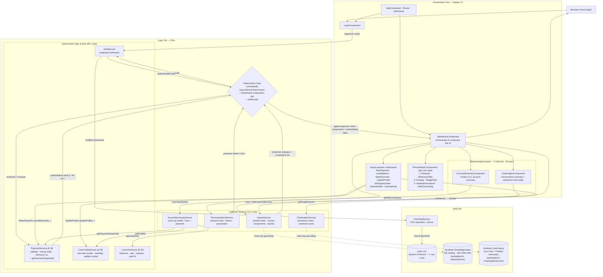

```mermaid
flowchart TB
  U["Borrower (mock login)"]

  subgraph P["Presentation Tier — Angular UI"]
    direction TB
    ROOT["AppComponent · Router · authGuard"]
    LOGIN["LoginComponent"]
    DASH["DashboardComponent<br/>orchestrates &amp; composes the UI"]
    %% shared cards sit together in a two-column panel
    subgraph SHARED["Shared insights panel — 2 columns · all users"]
      direction LR
      SUM["AccountSummaryComponent<br/>renders CLL account summary"]
      CHAT["ChatInsightsComponent<br/>conversation summary + sentiment tone-meter"]
    end
    ANS["Inquiry-answer components<br/>NextPayment · LoanBalance · MakePayment · UpdateProfile<br/>JobOpportunities · InterestRelief · GeneralHelp"]
    PANS["Personalized components (per user type)<br/>1: Rewards · RefinanceOffer<br/>2: Autopay · BudgetTips<br/>3: HardshipAssistance · DebtCounseling"]
  end

  subgraph L["Logic Tier — Plus"]
    direction LR
    subgraph CLLG["Cognitive services (CLL seat)"]
      IS["InquiryService<br/>classify intent · choose components · narrate"]
      PS["PersonalizationService<br/>welcome tone · theme · personalize"]
      CI["ChatInsightsService<br/>summarize chats · sentiment score"]
      %% NEW: sums up the deterministic BLL fact collectors
      AS["AccountSummaryService<br/>sums up profile + loan + payment"]
    end
    GATE{"Determinism Gate<br/>(conceptual)<br/>InquiryResult.deterministic<br/>+ Dashboard composition rule<br/>+ authGuard"}
    subgraph BLLG["Deterministic logic &amp; facts (BLL seat)"]
      PAY["PaymentService @ /bll<br/>validate · money math · reference no.<br/>+ getPaymentSnapshot()"]
      AUTH["AuthService<br/>credential verification"]
      %% NEW: deterministic collectors for the logged-in user
      UP["UserProfileService @ /bll<br/>borrower profile · standing · update contact"]
      LI["LoanInfoService @ /bll<br/>balances · rate · maturity · paid %"]
    end
    IS -->|"proposes category + component set"| GATE
    PS -->|"proposes theme / tone"| GATE
    GATE -->|"authorize / compute"| PAY
    GATE -->|"authenticate"| AUTH
    PAY -->|"authoritative result (+ ref no.)"| GATE
    AUTH -->|"authenticated user"| GATE
  end

  subgraph Dt["Data Tier"]
    UDS["UserDataService<br/>CSV repository + parser"]
    CSV[("users.csv<br/>System of Record — 1 row / user")]
    KB[("Synthetic Knowledge Base<br/>job catalog · rate-relief rules<br/>(embedded in InquiryService)")]
    CHATS[("Synthetic chat history<br/>Live Chat + Chatbot transcripts<br/>(embedded in ChatInsightsService)")]
  end

  %% Presentation composition
  U --> LOGIN
  ROOT --> LOGIN
  ROOT --> DASH
  DASH --> SUM
  DASH --> CHAT
  DASH --> ANS
  DASH --> PANS

  %% Presentation -> Logic (real DI / call edges)
  LOGIN -->|"login(user, pwd)"| AUTH
  DASH -->|"ask(query) → classify"| IS
  DASH -->|"getWelcome(user)"| PS
  ANS -->|"MakePayment.submitPayment(...)"| PAY
  ANS -->|"UpdateProfile.updateProfile(...)"| UP
  ANS -->|"Jobs / Relief grounded facts"| IS
  CHAT -->|"getInsights(user)"| CI

  %% NEW: CLL summary aggregates the deterministic BLL fact collectors
  %% (read-only facts — the CLL narrates, it never decides)
  SUM -->|"summarize(user)"| AS
  AS -->|"getProfile()"| UP
  AS -->|"getLoanInfo()"| LI
  AS -->|"getPaymentSnapshot()"| PAY

  %% Gate -> Presentation
  GATE -->|"gated response: which components + authoritative data"| DASH --> U

  %% Logic -> Data
  IS -.->|"read-only grounding"| KB
  CI -.->|"read-only grounding"| CHATS
  AUTH -->|"findByCredentials()"| UDS
  UDS -->|"read (HttpClient)"| CSV
```
