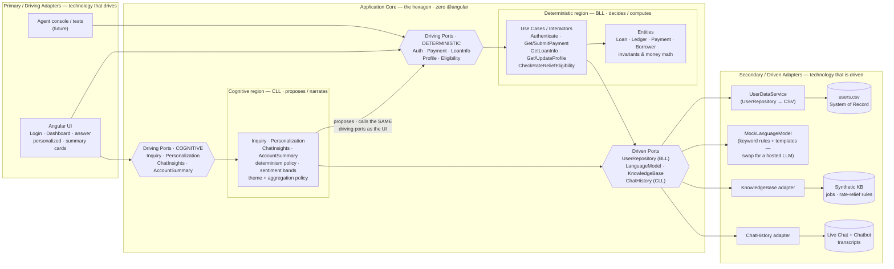

```mermaid
flowchart LR
  subgraph PRI["Primary / Driving Adapters — technology that drives"]
    direction TB
    UI["Angular UI<br/>Login · Dashboard · answer<br/>personalized · summary cards"]
    AGENT["Agent console / tests<br/>(future)"]
  end

  subgraph CORE["Application Core — the hexagon · zero @angular"]
    direction TB
    DPC{{"Driving Ports · COGNITIVE<br/>Inquiry · Personalization<br/>ChatInsights · AccountSummary"}}
    DPB{{"Driving Ports · DETERMINISTIC<br/>Auth · Payment · LoanInfo<br/>Profile · Eligibility"}}
    subgraph COG["Cognitive region — CLL · proposes / narrates"]
      CS["Inquiry · Personalization<br/>ChatInsights · AccountSummary<br/>determinism policy · sentiment bands<br/>theme + aggregation policy"]
    end
    subgraph DET["Deterministic region — BLL · decides / computes"]
      UC["Use Cases / Interactors<br/>Authenticate · Get/SubmitPayment<br/>GetLoanInfo · Get/UpdateProfile<br/>CheckRateReliefEligibility"]
      DOM["Entities<br/>Loan · Ledger · Payment · Borrower<br/>invariants &amp; money math"]
      UC --> DOM
    end
    DVP{{"Driven Ports<br/>UserRepository (BLL)<br/>LanguageModel · KnowledgeBase<br/>ChatHistory (CLL)"}}
    DPC --> CS
    DPB --> UC
    CS -->|"proposes · calls the SAME<br/>driving ports as the UI"| DPB
    CS --> DVP
    UC --> DVP
  end

  subgraph SEC["Secondary / Driven Adapters — technology that is driven"]
    direction TB
    REPO["UserDataService<br/>(UserRepository → CSV)"]
    CSV[("users.csv<br/>System of Record")]
    LLM["MockLanguageModel<br/>(keyword rules + templates —<br/>swap for a hosted LLM)"]
    KB["KnowledgeBase adapter"]
    KBF[("Synthetic KB<br/>jobs · rate-relief rules")]
    CH["ChatHistory adapter"]
    CHF[("Live Chat + Chatbot<br/>transcripts")]
    REPO --> CSV
    KB --> KBF
    CH --> CHF
  end

  %% Drivers → driving ports (the UI cannot tell the two port sets apart)
  UI --> DPC
  UI --> DPB
  AGENT --> DPB

  %% Core → driven ports → technology
  DVP --> REPO
  DVP --> LLM
  DVP --> KB
  DVP --> CH
```