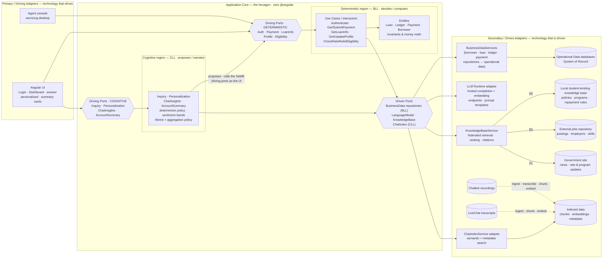

```mermaid
flowchart LR
  subgraph PRI["Primary / Driving Adapters — technology that drives"]
    direction TB
    UI["Angular UI<br/>Login · Dashboard · answer<br/>personalized · summary cards"]
    AGENT["Agent console<br/>servicing desktop"]
  end

  subgraph CORE["Application Core — the hexagon · zero @angular"]
    direction TB
    DPC{{"Driving Ports · COGNITIVE<br/>Inquiry · Personalization<br/>ChatInsights · AccountSummary"}}
    DPB{{"Driving Ports · DETERMINISTIC<br/>Auth · Payment · LoanInfo<br/>Profile · Eligibility"}}
    subgraph COG["Cognitive region — CLL · proposes / narrates"]
      CS["Inquiry · Personalization<br/>ChatInsights · AccountSummary<br/>determinism policy · sentiment bands<br/>theme + aggregation policy"]
    end
    subgraph DET["Deterministic region — BLL · decides / computes"]
      UC["Use Cases / Interactors<br/>Authenticate · Get/SubmitPayment<br/>GetLoanInfo · Get/UpdateProfile<br/>CheckRateReliefEligibility"]
      DOM["Entities<br/>Loan · Ledger · Payment · Borrower<br/>invariants &amp; money math"]
      UC --> DOM
    end
    DVP{{"Driven Ports<br/>BusinessData repositories (BLL)<br/>LanguageModel · KnowledgeBase<br/>ChatIndex (CLL)"}}
    DPC --> CS
    DPB --> UC
    CS -->|"proposes · calls the SAME<br/>driving ports as the UI"| DPB
    CS --> DVP
    UC --> DVP
  end

  subgraph SEC["Secondary / Driven Adapters — technology that is driven"]
    direction TB
    BDS["BusinessDataServices<br/>(borrower · loan · ledger · payment<br/>repositories → operational data)"]
    ODS[("Operational Data databases<br/>System of Record")]
    LLM["LLM Runtime adapter<br/>hosted completion + embedding<br/>endpoints · prompt templates"]
    KBS["KnowledgeBaseService<br/>federated retrieval · ranking · citations"]
    KBL[("Local student-lending knowledge base<br/>policies · programs · repayment rules")]
    JOBS[("External jobs repository<br/>postings · employers · skills")]
    GOV[("Government site<br/>news · rate &amp; program updates")]
    CIS["ChatIndexService adapter<br/>semantic + metadata search"]
    CIDX[("Indexed data<br/>chunks · embeddings · metadata")]
    LCT[("LiveChat transcripts")]
    CBR[("Chatbot recordings")]
    BDS --> ODS
    KBS -->|"[a]"| KBL
    KBS -->|"[b]"| JOBS
    KBS -->|"[c]"| GOV
    CIS --> CIDX
    LCT -.->|"ingest · chunk · embed"| CIDX
    CBR -.->|"ingest · transcribe · chunk · embed"| CIDX
  end

  %% Drivers → driving ports (the UI cannot tell the two port sets apart)
  UI --> DPC
  UI --> DPB
  AGENT --> DPB

  %% Core → driven ports → technology
  DVP --> BDS
  DVP --> LLM
  DVP --> KBS
  DVP --> CIS
```
