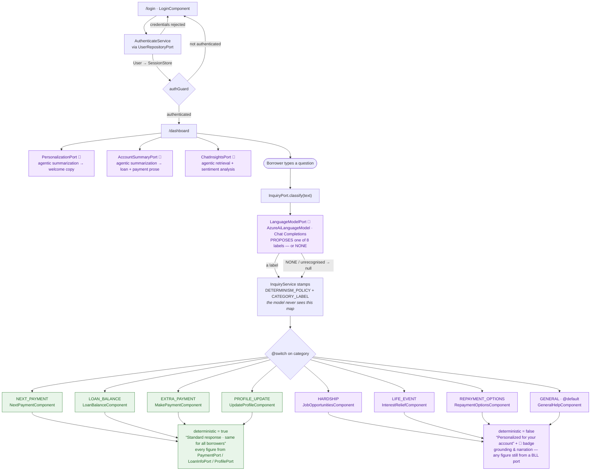

```mermaid
flowchart TD
    A["/login · LoginComponent"] --> B["AuthenticateService<br/>via UserRepositoryPort"]
    B -->|credentials rejected| A
    B -->|"User → SessionStore"| C{authGuard}
    C -->|not authenticated| A
    C -->|authenticated| D["/dashboard"]

    D --> E["PersonalizationPort 🤖<br/>agentic summarization → welcome copy"]
    D --> F["AccountSummaryPort 🤖<br/>agentic summarization → loan + payment prose"]
    D --> G["ChatInsightsPort 🤖<br/>agentic retrieval + sentiment analysis"]
    D --> H(["Borrower types a question"])

    H --> I["InquiryPort.classify(text)"]
    I --> J["LanguageModelPort 🤖<br/>AzureAiLanguageModel · Chat Completions<br/>PROPOSES one of 8 labels — or NONE"]
    J -->|"a label"| K
    J -->|"NONE / unrecognised → null"| K["InquiryService stamps<br/>DETERMINISM_POLICY + CATEGORY_LABEL<br/><i>the model never sees this map</i>"]
    K --> S{"@switch on category"}

    S --> P1["NEXT_PAYMENT<br/>NextPaymentComponent"]
    S --> P2["LOAN_BALANCE<br/>LoanBalanceComponent"]
    S --> P3["EXTRA_PAYMENT<br/>MakePaymentComponent"]
    S --> P4["PROFILE_UPDATE<br/>UpdateProfileComponent"]
    S --> P5["HARDSHIP<br/>JobOpportunitiesComponent"]
    S --> P6["LIFE_EVENT<br/>InterestReliefComponent"]
    S --> P7["REPAYMENT_OPTIONS<br/>RepaymentOptionsComponent"]
    S --> P8["GENERAL · @default<br/>GeneralHelpComponent"]

    P1 --> ZB
    P2 --> ZB
    P3 --> ZB
    P4 --> ZB["deterministic = true<br/>“Standard response · same for all borrowers”<br/>every figure from PaymentPort / LoanInfoPort / ProfilePort"]
    P5 --> ZC
    P6 --> ZC
    P7 --> ZC
    P8 --> ZC["deterministic = false<br/>“Personalized for your account” + 🤖 badge<br/>grounding &amp; narration — any figure still from a BLL port"]

    classDef bll fill:#e8f5e9,stroke:#2e7d32,color:#1b5e20;
    classDef cll fill:#f3e8ff,stroke:#7c3aed,color:#4c1d95;
    class P1,P2,P3,P4,ZB bll;
    class P5,P6,P7,P8,ZC cll;
    class E,F,G,J cll;
```