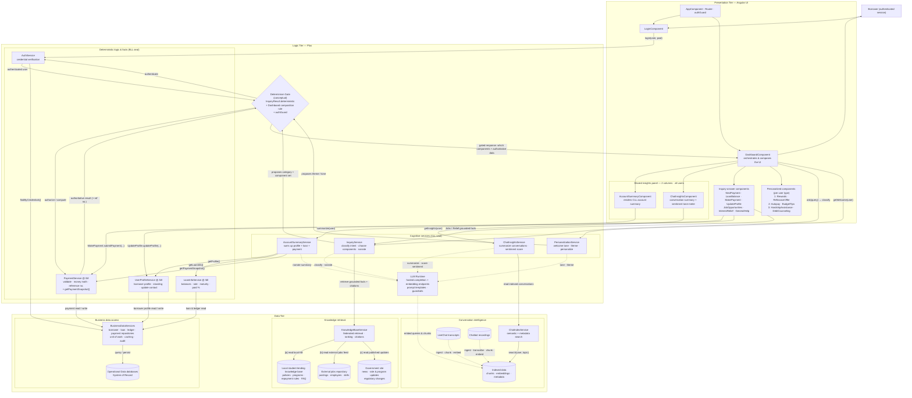

```mermaid
flowchart TB
  U["Borrower (authenticated session)"]

  subgraph P["Presentation Tier — Angular UI"]
    direction TB
    ROOT["AppComponent · Router · authGuard"]
    LOGIN["LoginComponent"]
    DASH["DashboardComponent<br/>orchestrates &amp; composes the UI"]
    %% shared cards sit together in a two-column panel
    subgraph SHARED["Shared insights panel — 2 columns · all users"]
      direction LR
      SUM["AccountSummaryComponent<br/>renders CLL account summary"]
      CHAT["ChatInsightsComponent<br/>conversation summary + sentiment tone-meter"]
    end
    ANS["Inquiry-answer components<br/>NextPayment · LoanBalance · MakePayment · UpdateProfile<br/>JobOpportunities · InterestRelief · GeneralHelp"]
    PANS["Personalized components (per user type)<br/>1: Rewards · RefinanceOffer<br/>2: Autopay · BudgetTips<br/>3: HardshipAssistance · DebtCounseling"]
  end

  subgraph L["Logic Tier — Plus"]
    direction LR
    subgraph CLLG["Cognitive services (CLL seat)"]
      IS["InquiryService<br/>classify intent · choose components · narrate"]
      PS["PersonalizationService<br/>welcome tone · theme · personalize"]
      CI["ChatInsightsService<br/>summarize conversations · sentiment score"]
      AS["AccountSummaryService<br/>sums up profile + loan + payment"]
    end
    LLMR["LLM Runtime<br/>hosted completion + embedding endpoints<br/>prompt templates · guardrails"]
    GATE{"Determinism Gate<br/>(conceptual)<br/>InquiryResult.deterministic<br/>+ Dashboard composition rule<br/>+ authGuard"}
    subgraph BLLG["Deterministic logic &amp; facts (BLL seat)"]
      PAY["PaymentService @ /bll<br/>validate · money math · reference no.<br/>+ getPaymentSnapshot()"]
      AUTH["AuthService<br/>credential verification"]
      UP["UserProfileService @ /bll<br/>borrower profile · standing · update contact"]
      LI["LoanInfoService @ /bll<br/>balances · rate · maturity · paid %"]
    end
    IS -->|"proposes category + component set"| GATE
    PS -->|"proposes theme / tone"| GATE
    GATE -->|"authorize / compute"| PAY
    GATE -->|"authenticate"| AUTH
    PAY -->|"authoritative result (+ ref no.)"| GATE
    AUTH -->|"authenticated user"| GATE
  end

  subgraph Dt["Data Tier"]
    direction TB
    subgraph BDSG["Business data access"]
      BDS["BusinessDataServices<br/>borrower · loan · ledger · payment repositories<br/>unit of work · caching · audit"]
      ODS[("Operational Data databases<br/>System of Record")]
      BDS -->|"query / persist"| ODS
    end
    subgraph KBSG["Knowledge retrieval"]
      KBS["KnowledgeBaseService<br/>federated retrieval · ranking · citations"]
      KBL[("Local student-lending knowledge base<br/>policies · programs · repayment rules · FAQ")]
      JOBS[("External jobs repository<br/>postings · employers · skills")]
      GOV[("Government site<br/>news · rate &amp; program updates<br/>regulatory changes")]
      KBS -->|"[a] read local KB"| KBL
      KBS -->|"[b] read external jobs feed"| JOBS
      KBS -->|"[c] read published updates"| GOV
    end
    subgraph IDXG["Conversation intelligence"]
      CIS["ChatIndexService<br/>semantic + metadata search"]
      CIDX[("Indexed data<br/>chunks · embeddings · metadata")]
      LCT[("LiveChat transcripts")]
      CBR[("Chatbot recordings")]
      CIS -->|"search(user, topic)"| CIDX
      LCT -.->|"ingest · chunk · embed"| CIDX
      CBR -.->|"ingest · transcribe · chunk · embed"| CIDX
    end
  end

  %% Presentation composition
  U --> LOGIN
  ROOT --> LOGIN
  ROOT --> DASH
  DASH --> SUM
  DASH --> CHAT
  DASH --> ANS
  DASH --> PANS

  %% Presentation -> Logic (real DI / call edges)
  LOGIN -->|"login(user, pwd)"| AUTH
  DASH -->|"ask(query) → classify"| IS
  DASH -->|"getWelcome(user)"| PS
  ANS -->|"MakePayment.submitPayment(...)"| PAY
  ANS -->|"UpdateProfile.updateProfile(...)"| UP
  ANS -->|"Jobs / Relief grounded facts"| IS
  CHAT -->|"getInsights(user)"| CI

  %% CLL summary aggregates the deterministic BLL fact collectors
  %% (read-only facts — the CLL narrates, it never decides)
  SUM -->|"summarize(user)"| AS
  AS -->|"getProfile()"| UP
  AS -->|"getLoanInfo()"| LI
  AS -->|"getPaymentSnapshot()"| PAY

  %% Cognitive services run on the shared model runtime
  IS -.->|"classify · narrate"| LLMR
  PS -.->|"tone · theme"| LLMR
  CI -.->|"summarize · score sentiment"| LLMR
  AS -.->|"narrate summary"| LLMR

  %% Gate -> Presentation
  GATE -->|"gated response: which components + authoritative data"| DASH --> U

  %% Logic -> Data
  IS -->|"retrieve grounded facts + citations"| KBS
  CI -->|"read indexed conversations"| CIS
  LLMR -.->|"embed queries &amp; chunks"| CIDX
  AUTH -->|"findByCredentials()"| BDS
  UP -->|"borrower profile read / write"| BDS
  LI -->|"loan &amp; ledger read"| BDS
  PAY -->|"payment read / write"| BDS
```
